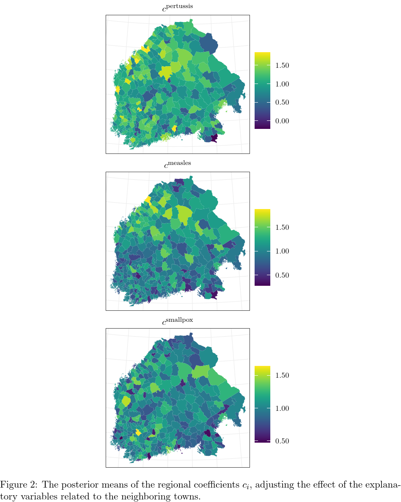
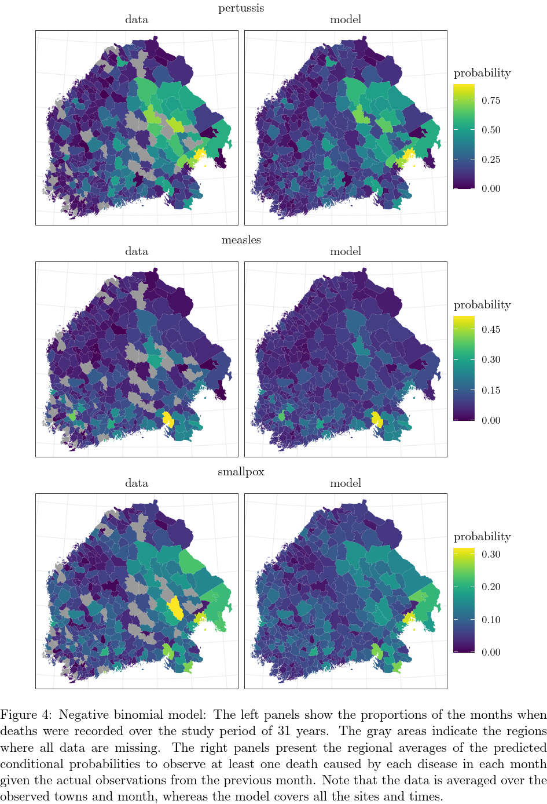
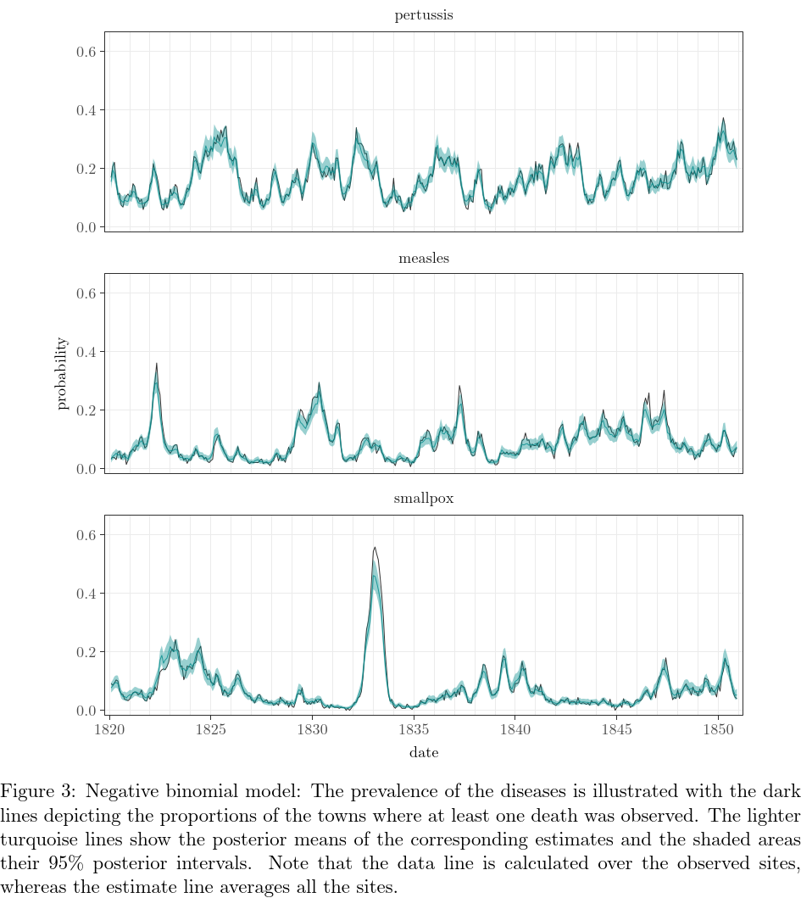
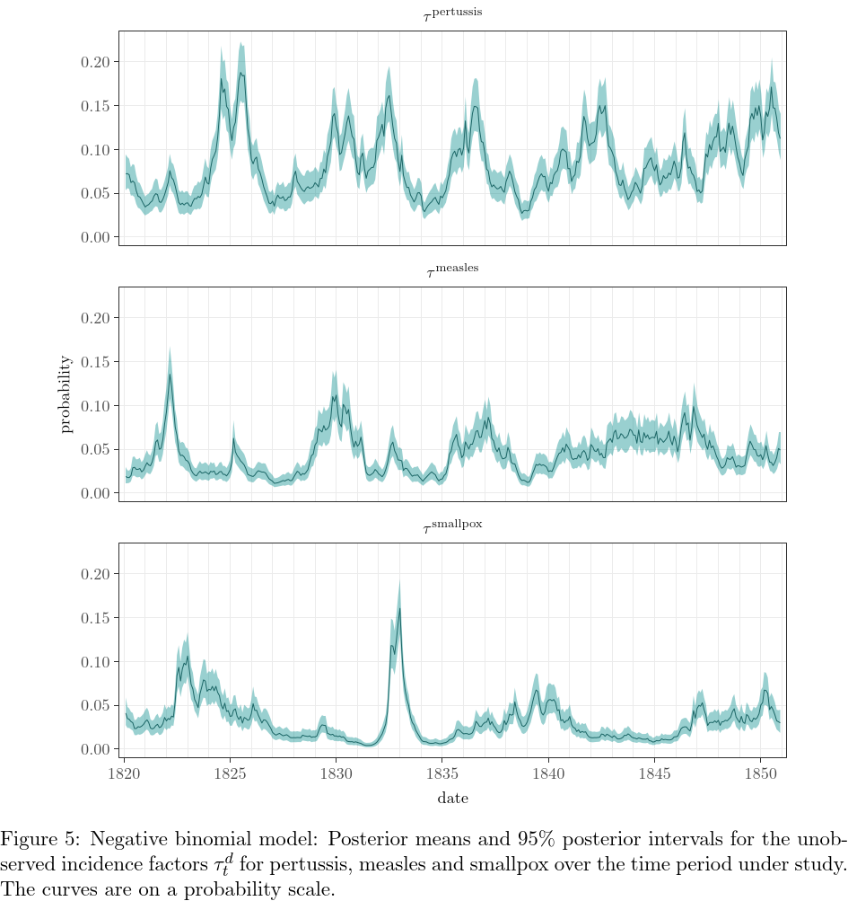
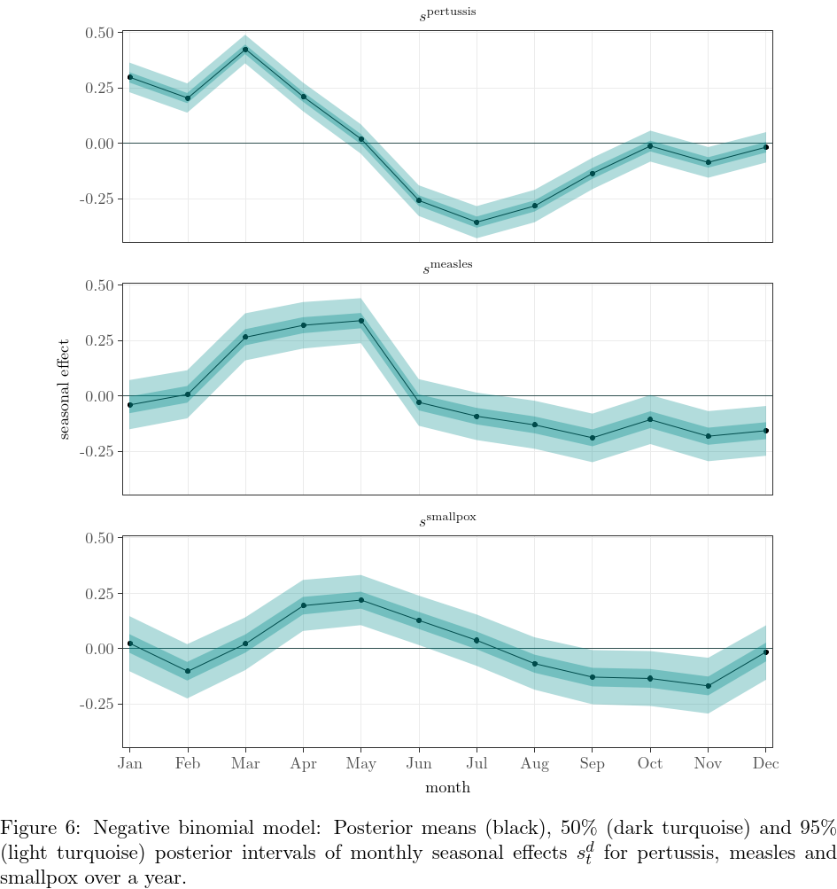
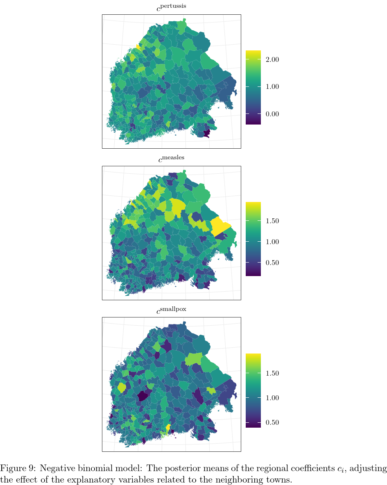
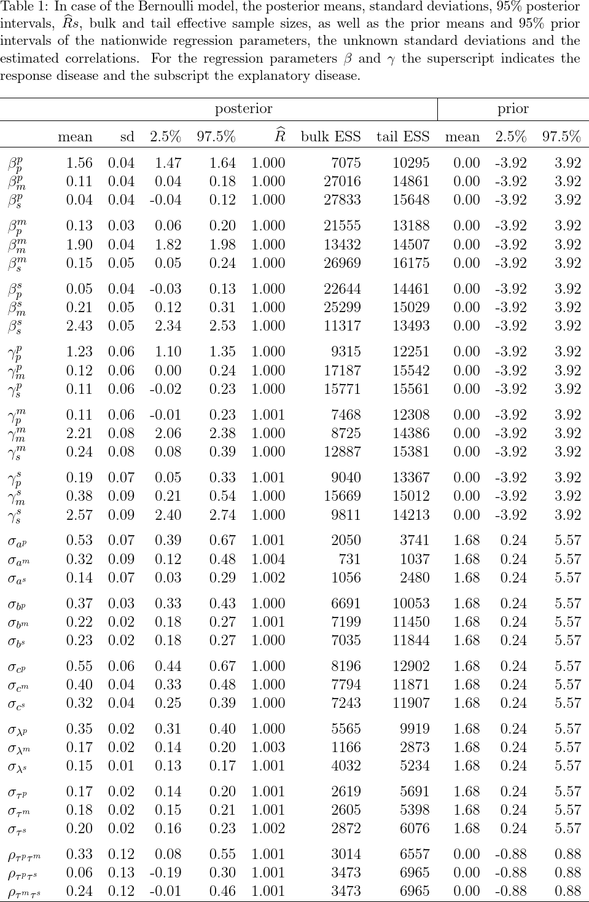
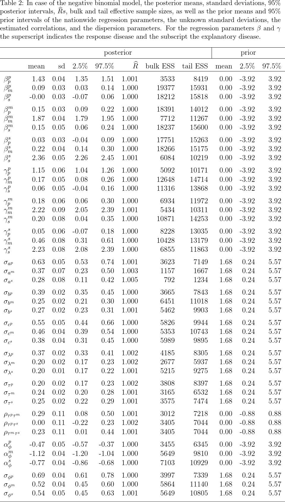

# infectionDynamics

Supplementary material for the paper *Spatio-temporal modeling of co-dynamics of smallpox, measles and pertussis in pre-healthcare Finland*.

## Files

This repository contains the following supplementary files:
- `infectionpars.rds`: the data, describing the monthly, regional, dichotomous death occurrences, as well as the death counts, from January 1820 to December 1850, and some additional parameters needed to fit the model. A more specific description of the contents of the parameter file can be found from the beginning of the files `bern_models.R` and `negbin_models.R`.
- `infection_data.xlsx`: the raw data of the monthly, regional, dichotomous death occurrences from January 1820 to December 1850. The data in `infectionpars.rds` is derived from this and applicable for the modeling.
- `infection_data_counts.xlsx`: the raw data of the monthly, regional, death counts from January 1820 to December 1850. The data in `infectionpars.rds` is derived from this and applicable for the modeling.
- `bern_dependent.stan`, `bern_independent.stan`, `bern_dependent_s.stan`, `negbin_dependent.stan`, `negbin_independent.stan`, `negbin_dependent_s.stan`: formal, technical model specifications written in Stan. The first one is the main model in the article, and the rest are the reference models (indipendent model and dependent model without seasonal effect). These all contain also description of how to get pointwise log-likelihood values for the leave-one-out cross-validation.
- `bern_models.R`, `negbin_models.R`: R codes to fit all the variants of the Bernoulli models and the negative binomial models. These include also data description and frequency inspections of the incidence factors.
- `bern_dependent_pred.R`, `bern_independent_pred.R`, `negbin_dependent_pred.R`, `negbin_independent_pred.R`: R codes to estimate the predicted probabilities by the different models using stanfit objects gained from fitting the Stan models. The dependent versions include description in comments of how to repeat the predictions for models without seasonal component.
- `loo_cv.R`: R codes to fit the Stan models, and to compare them with leave-one-out cross-validation.

## Figures

Figures 1 and 2 consider the Bernoulli model.

### Figure 1

### Figure 2

Figures 3-9 consider the negative binomial model, representing results corresponding the ones reported of the Bernoulli model in section _Results_ in the article. The negative binomial model is described in more detail in section _Model comparison_ in the article.

### Figure 3

### Figure 4

### Figure 5

### Figure 6

### Figure 7

### Figure 8

### Figure 9

## Tables

Table 1 represents results of all time and town invariant parameter estimates with their posterior and prior intervals of the Bernoulli model, whereas Table 2 shows those of the negative binomial model.

### Table 1

### Table 2

