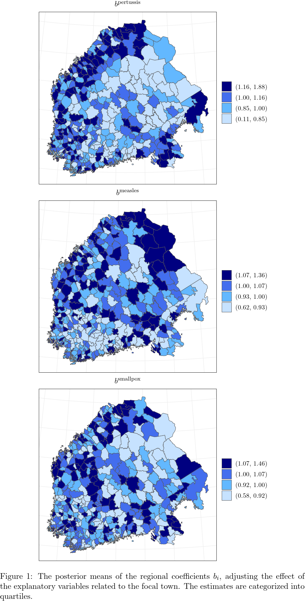
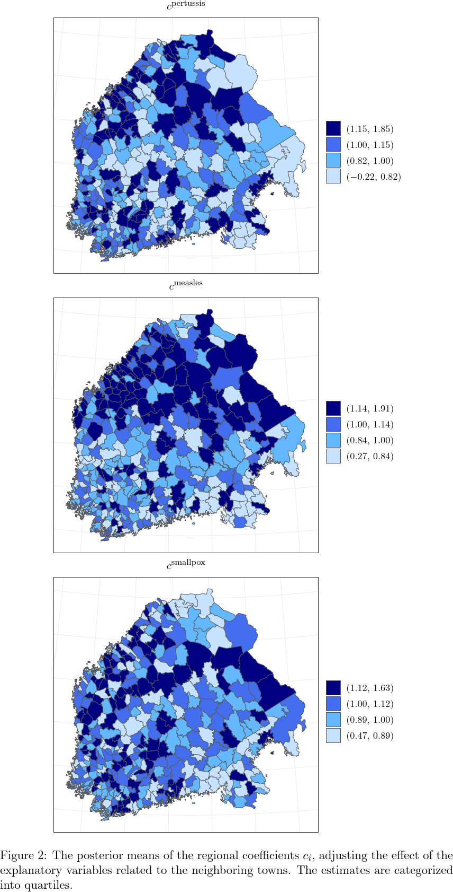
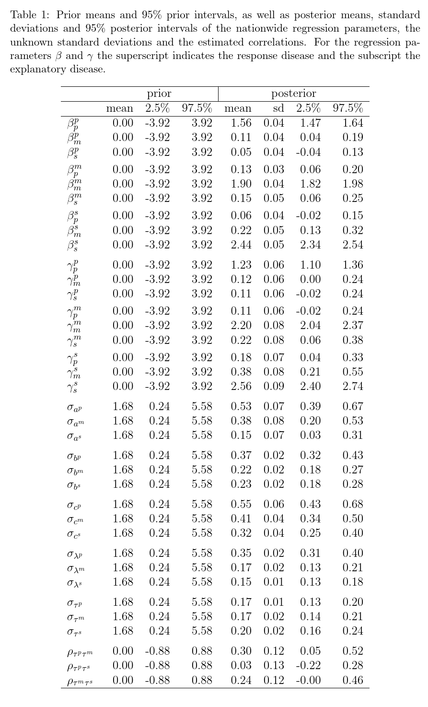

# infectionDynamics

Supplementary material for the paper *Spatio-temporal modeling of co-dynamics of smallpox, measles and pertussis in pre-healthcare Finland*.

## Files

This repository contains the following supplementary files:
- `infectionpars.rds`: the data, including the monthly, regional, dichotomous death occurrences from January 1820 to December 1850, and some additional parameters needed to fit the model. A more specific description of the contents of the parameter file can be found from the beginning of the file `infection_model.R`.
- `infection_model.stan`: formal, technical model specification written in Stan. This also includes comments describing how to fit a model omitting seasonal effects.
- `infection_model_withloo.stan`: the same model as the "infection_model", but, in order to do the leave-one-out cross-validation, written in a way that saves pointwise log-likelihood values, thus being slower.
- `infection_model_independent_withloo.stan`: submodel of the "infection_model", assuming the infections are independent. Written in a way that saves pointwise log-likelihood values in order to do the leave-one-out cross-validation.
- `infection_model.R`: R code to fit the model "infection_model". Includes also data description and frequency inspections of the incidence factors.
- `loo_cv.R`: R codes to fit the models "infection_model_withloo" and "infection_model_independent_withloo", and to compare them with leave-one-out cross-validation.

## Figures
### Figure 1

### Figure 2

## Tables
### Table 1

