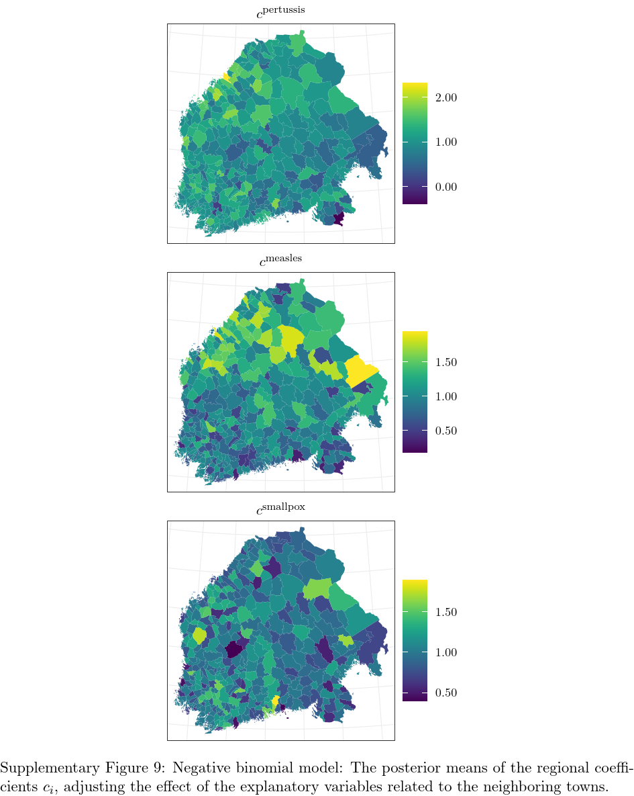
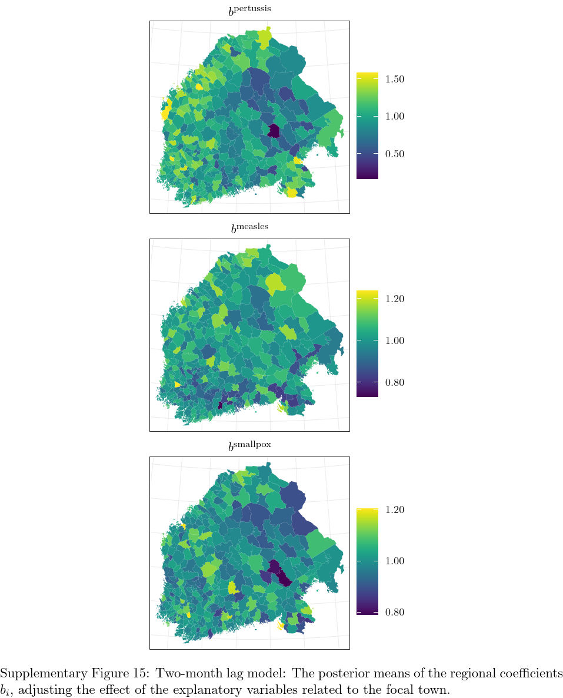

# infectionDynamics

Supplementary material for the paper *Spatio-temporal modeling of co-dynamics of smallpox, measles and pertussis in pre-healthcare Finland*.

## Files

This repository contains the following supplementary files:
- `infectionpars.rds`: the data, describing the monthly, regional, dichotomous death occurrences, as well as the death counts, from January 1820 to December 1850, and some additional parameters needed to fit the model. A more specific description of the contents of the parameter file can be found from the beginning of the files `bern_models.R` and `negbin_models.R`.
- `infection_data.xlsx`: the raw data of the monthly, regional, dichotomous death occurrences from January 1820 to December 1850. The data in `infectionpars.rds` are derived from this, and are applicable for the modeling.
- `infection_data_counts.xlsx`: the raw data of the monthly, regional, death counts from January 1820 to December 1850. The data in `infectionpars.rds` are derived from this, and are applicable for the modeling.
- `infectionpars_week.rds`: the data, describing the weekly, regional, dichotomous death occurrences, as well as the death counts, from January 1820 to December 1850, and some additional parameters needed to fit the model. A more specific description of the contents of the parameter file can be found from the beginning of the file `bern_model_week_lag4.R`. Essentially, this is the same as `infectionpars.rds`, but on a weekly reporting level.
- `infection_data_week.xlsx`: the raw data of the weekly, regional, dichotomous death occurrences from January 1820 to December 1850. The data in `infectionpars_week.rds` are derived from this, and are applicable for the modeling.
- `bern_dependent.stan`, `bern_independent.stan`, `bern_dependent_s.stan`, `negbin_dependent.stan`, `negbin_independent.stan`, `negbin_dependent_s.stan`: formal, technical model specifications written in Stan. The first one is the main model in the article, and the rest are the reference models (independent model and dependent model without seasonal effect). These all contain also description of how to get pointwise log-likelihood values for the leave-one-out cross-validation.
- `bern_models.R`, `negbin_models.R`: R codes to fit all the variants of the Bernoulli models and the negative binomial models. These include also data description and frequency inspections of the incidence factors.
- `bern_dependent_pred.R`, `bern_independent_pred.R`, `negbin_dependent_pred.R`, `negbin_independent_pred.R`: R codes to estimate the predicted probabilities by the different models using stanfit objects gained from fitting the Stan models. The dependent versions include description in comments of how to repeat the predictions for models without seasonal component.
- `loo_cv.R`: R codes to fit the Stan models, and to compare them with leave-one-out cross-validation.
- `bern_model_lag2.R`, `bern_dependent_pred_lag2.R`: R codes to fit the the model with one-month and two-month lags, and to calculate the predictions based on that.
- `bern_model_week_lag4.R`: R codes to fit the weekly model with one-week to four-week lags without seasonal component.

## Updates
An error was found from the codes in the file `loo_cv.R` considering the comparison of the models omitting the last two years of the data. The file has been updated to hold the correct codes and the erroneous lines are commented out. This does not affect out interpretations, even though the last two columns of Table 2 were originally incorrect. The updated Table 2 can be found below.

#### Table 2

## Bernoulli model
### Figures

Supplementary Figures 1 and 2 consider the Bernoulli model.

#### Supplementary Figure 1

#### Supplementary Figure 2

### Tables

Supplementary Table 1 represents results of all time and town invariant parameter estimates with their posterior and prior intervals in the case of the Bernoulli model.

#### Supplementary Table 1

## Negative binomial model
### Figures

Supplementary Figures 3-9 consider the negative binomial model, representing results corresponding the ones reported of the Bernoulli model in section _Results_ in the article. The negative binomial model is described in more detail in section _Model comparison_ in the article.

#### Supplementary Figure 3

#### Supplementary Figure 4

#### Supplementary Figure 5

#### Supplementary Figure 6

#### Supplementary Figure 7

#### Supplementary Figure 8

#### Supplementary Figure 9

### Tables

Supplementary Table 2 represents results of all time and town invariant parameter estimates with their posterior and prior intervals in the case of the negative binomial model.

#### Supplementary Table 2

## Bernoulli model with one-month and two-month lags
### Figures

Supplementary Figures 10-16 consider the Bernoulli model with one-month and two-month lags, representing results corresponding the ones reported of the Bernoulli model in section _Results_ in the article. This model is described in section _Model comparison_ in the article.

#### Supplementary Figure 10

#### Supplementary Figure 11

#### Supplementary Figure 12

#### Supplementary Figure 13

#### Supplementary Figure 14

#### Supplementary Figure 15

#### Supplementary Figure 16

### Tables

Supplementary Table 3 represents results of all time and town invariant parameter estimates with their posterior and prior intervals in the case of the Bernoulli model with one-month and two-month lags.

#### Supplementary Table 3

